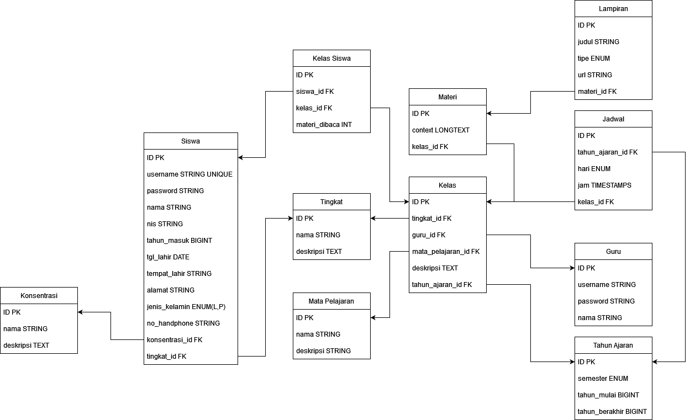
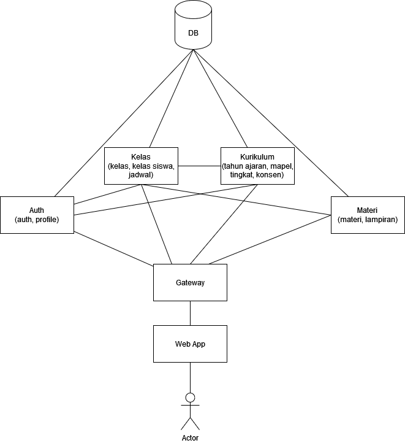

# Project Learning Management System

---

Project pembuatan aplikasi learning management system berbasis microservice untuk memenuhi tugas mata kuliah interoperabilitas. Referensi aplikasi yang dipakai adalah sistem [Oase](https://oase.unud.ac.id/) milik Universitas Udayana.

## Daftar Isi

-   [Gambaran Umum](#gambaran-umum)
-   [Rancangan PDM](#rancangan-pdm)
-   [Rancangan Pembagian Modul](#rancangan-pembagian-modul)
-   [Alur Pengerjaan Aplikasi](#alur-pengerjaan-aplikasi)

## Gambaran Umum

Aplikasi ini berbasis microservice yang berarti setiap anggota team akan mengerjakan setiap layanan pada folder yang sudah disediakan di repositori ini. Teknologi yang ingin digunakan dalam layanan diserahkan kepada anggota team yang bertanggung jawab pada layanan tersebut. Setiap layanan akan berbasis REST API

## Rancangan PDM



## Rancangan Pembagian Modul



## Alur Pengerjaan Aplikasi

Aplikasi dikerjakan melalui github untuk mempermudah kolaborasi. Alur pengerjaan aplikasi akan dijabarkan sebagai berikut.

### Setup

1. install git dan buat akun github
2. clone repositori ini

    ```git
    git clone https://github.com/salamanderman234/project-intero-2023.git
    ```

3. masuk ke branch `dev`

    ```git
    git checkout dev
    ```

### Pembuatan branch

Pengerjaan dilakukan pada branch layanan masing-masing misal untuk layanan auth dikerjakan pada `layanan/auth`. Seluruh commit dilakukan pada branch tersebut. Pembuatan branch dijabarkan sebagai berikut.

1. Pastikan sudah berada pada branch `dev` dengan menggunakan `git status`. Pastikan tertulis `on branch dev`

    ```git
    git status
    ```

2. Buat branch baru

    ```git
    git checkout layanan/<nama layanan>
    ```

3. Pastikan lagi sudah masuk ke branch yang baru dibuat dengan melakukan `git status`. Pastikan tertulis `on branch layanan/<nama layanan>`
4. Pengerjaan aplikasi sekarang sudah bisa dimulai

### Melakukan commit dan push

Commit dilakukan saat ingin menyimpan pekerjaan yang sudah dilakukan. Commit dilakukan di masing-masing branch yang sudah dibuat. Push dilakukan untuk menyimpan pekerjaan ke repositori online yang ada di github. Cara melakukan commit dan push dijabarkan sebagai berikut.

1. Pastikan sudah berada pada branch layanan masing-masing
2. Tambahkan seluruh file ke staging

    ```git
    git add .
    ```

    atau jika ingin menambahkan hanya file spesifik

    ```git
    git add <path file>
    ```

3. Buat commit

    ```git
    git commit -m "<pesan commit>"
    ```

4. Push (optional, bisa dilakukan ketika ingin melakukan merge atau saat selesai melakukan commit)

    ```git
    git push origin layanan/<nama layanan>
    ```

    > bisa menambahkan parameter -u agar ketika ingin melakukan push selanjutnya hanya perlu mengetikan git push

### Melakukan merge branch

Merge dilakukan ketika layanan yang dikerjakan sudah dirasa ok dan bagus. Merge akan menggabungkan antara branch layanan (yang dikerjakan) dan branch `dev`. Pastikan bahwa branch yang ingin di merge adalah branch `dev` dan bukan `main`. Merge ke branch `main` dari branch `dev` akan dilakukan diakhir pengerjaan ketika seluruh layanan sudah jadi. Proses merge branch dijabarkan sebagai berikut.

1. Pastikan sudah di branch layanan dan seluruh pekerjaan di lokal sudah dipush ke repositori github
2. Masuk ke halaman repositori
3. Ke halaman pull requests
4. Pilih new pull requests
5. Pilih branch compare menjadi branch layanan
6. Pilih branch base menjadi `dev`
7. Buat pull request dan pilih seluruh anggota team sebagai reviewer
8. Diskusikan dengan anggota lain bahwa sudah membuat pull request

### Resolve conflict

Saat membuat pull request, bisa saja ada conflict yang terjadi. Saat itu terjadi, maka seluruh team harus melakukan diskusi untuk menyelesaikan conflict yang muncul. Jika seluruh conflict sudah resolve maka merge dapat dilakukan.
